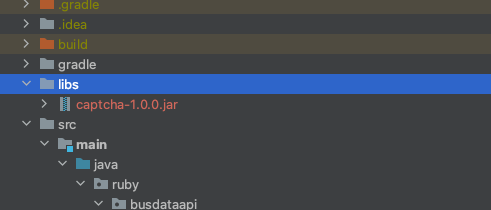
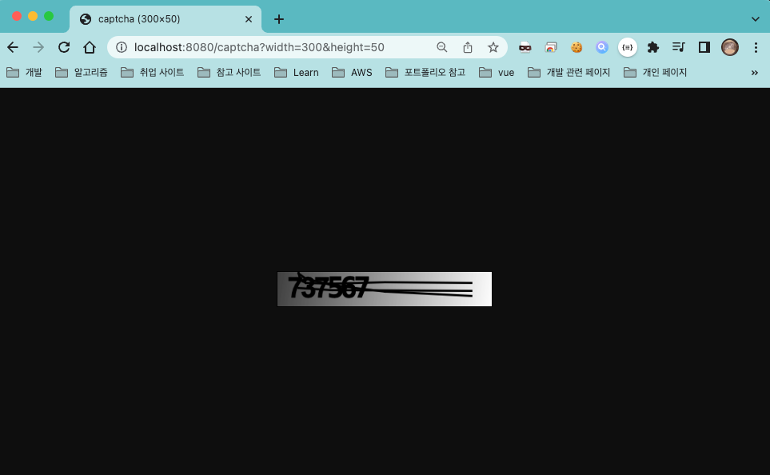

## Captcha Library
- 인증 Captcha 기능 제공 라이브러리

<br>

## Settings
### 라이브러리 추가  
  
```groovy
dependencies {
    implementation files('libs/captcha-1.0.0.jar')
}
```
```yaml
captcha:
  url: "captcha"                // captcha 요청 url. ex) localhost:8080/captcha?width=200&height=50
  attribute-name: "captcha"     // 세션에 보관할 captcha 인스턴스의 attribute name
  answer-length: 6              // captcha 생성시 텍스트 길이
  size:
    default-width: 200          // captcha 요청시 길이 값을 지정하지 않을 경우 기본값 
    default-height: 40          // captcha 요청시 높이 값을 지정하지 않을 경우 기본값 
```

<br>

### Example  
